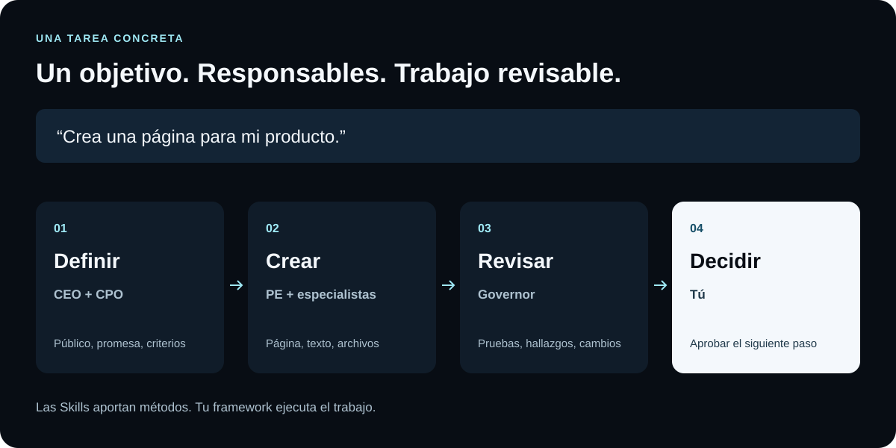
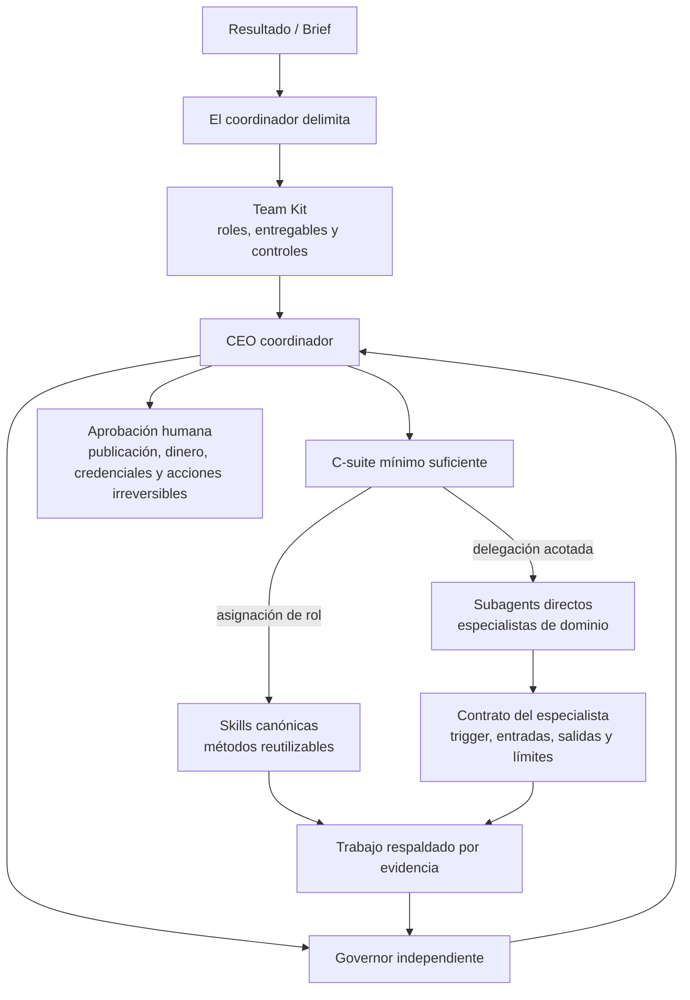
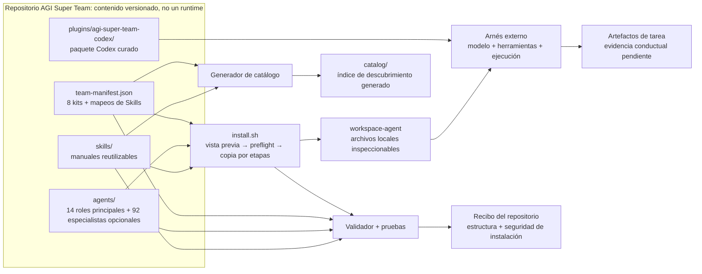

<p align="right"><a href="./README.md">English</a> · <a href="./README_CN.md">中文</a></p>

<p align="center">
  
</p>

<p align="center"></p>

<h1 align="center">AGI Super Team</h1>

<p align="center"><strong>Un equipo organizado e instalable de Agents + Skills para frameworks de agentes de IA locales.</strong></p>

<p align="center">
  Comienza con un resultado: el CEO coordina a los ejecutivos, los ejecutivos delegan en especialistas, las Skills aportan métodos y el Governor verifica el resultado.
</p>

AGI Super Team no es un plugin exclusivo de Codex. Es un **sistema organizado y versionado de Agents + Skills** para Claude Code, Codex, OpenClaw, Hermes y otros frameworks locales mediante 19 adaptadores explícitos.

El mismo contrato organizativo funciona en todos los frameworks: 14 roles principales, 92 especialistas opcionales, Skills reutilizables, 8 Teams orientados a resultados, revisión independiente y aprobación humana explícita.

Cada adaptador traduce ese contrato a las capacidades reales del framework de destino.

## Qué hace tu equipo en una tarea concreta

Pide una página para tu producto y revisa el brief, los archivos y los hallazgos. Este flujo es ilustrativo; no es el registro de una ejecución completada.



| Tu objetivo | Entregables esperados | Team |
|---|---|---|
| Crear un producto | Brief → implementación → revisión | [product-delivery](./starter-kits/product-delivery/) |
| Crear contenido | Fuentes → borradores → revisión de afirmaciones | [content-creator](./starter-kits/content-creator/) |
| Investigar una decisión | Pregunta → evidencias → decisión | [research-decision](./starter-kits/research-decision/) |

[**Explorar el sitio →**](https://aaaaqwq.github.io/AGI-Super-Team/)

**Versiones:** Aquí no se escribe ningún número de versión a propósito: un número fijo queda obsoleto en la siguiente publicación. `@latest` instala lo que npm publique en ese momento, que puede no coincidir con este checkout. Compruébalo tú mismo en lugar de confiar en el texto:

```bash
npm view agi-super-team version               # la versión a la que resuelve `@latest`
node -p "require('./package.json').version"   # este árbol de código
```

Las dist-tags distintas de `latest` no garantizan apuntar a una versión actual. Para un ejemplo fechado de divergencia entre código y registry, con su recuperación, consulta el [diagnóstico de la versión 1.5.0](./docs/guides/npm-release-status.md).

## Instalar en tu framework de agentes

Lista los 19 objetivos de adaptador, previsualiza uno y luego aplica la misma selección:

```bash
npx -y agi-super-team@latest --list-tools
npx -y agi-super-team@latest --tool claude-code
npx -y agi-super-team@latest --tool claude-code --install --connect
npx -y agi-super-team@latest --tool claude-code --doctor
```

Los comandos anteriores usan el paquete público de npm. Para automatizaciones reproducibles, no dejes `@latest` en una canalización fijada: resuelve primero una versión publicada exacta y fija esa, de modo que una publicación posterior no cambie lo que instala tu ejecución:

```bash
AGI_VERSION="$(npm view agi-super-team version)"
npx -y "agi-super-team@${AGI_VERSION}" --tool claude-code --install --connect
```

La distribución npm mantiene accesibles sus puntos de entrada `SKILL.md` e incluye todos los archivos de cada Skill asignado por `config/team-manifest.json`. La colección [Skills originales de Daniel](./skills/original/) reúne el trabajo propio con procedencia revisada. Clona el repositorio si necesitas todos los recursos auxiliares de la biblioteca completa.

Reemplaza `claude-code` con un ID de `--list-tools`. Usa `--all-tools` solo cuando quieras intencionalmente cada adaptador global y de proyecto. Una ejecución sin argumentos permanece como la vista previa heredada de Codex; la nueva automatización debe especificar siempre `--tool` o `--all-tools`.

### Cinco frameworks principales

| Plataforma | Comando de vista previa | Capacidad instalada |
|---|---|---|
| **Claude Code** | `npx -y agi-super-team@latest --tool claude-code` | Agents Markdown nativos + Skills canónicas + orquestador de Claude |
| **Codex** | `npx -y agi-super-team@latest --tool codex` | CEO en la sesión principal + Agents TOML nativos + Skills canónicas |
| **OpenClaw** | `npx -y agi-super-team@latest --tool openclaw` | Workspaces de Agent con namespace + Skills canónicas + fusión segura de configuración |
| **Hermes Agent** | `npx -y agi-super-team@latest --tool hermes` | Skills de rol + Skills canónicas + blueprints de Profiles/Kanban |
| **DeepSeek Harness** | `npx -y agi-super-team@latest --tool dsh` | Parche cordis declarativo que habilita la raíz de Skills + bloque CEO en AGENTS.md + preset |

`--install` materializa los archivos; `--install --connect` también escribe un recibo de conexión. OpenClaw hace primero un dry-run y después actualiza las entradas gestionadas de `agents.list`, conservando los Agents no gestionados y sin crear bindings de canal. Claude y Codex usan descubrimiento por sistema de archivos. Hermes genera blueprints, pero no crea Profiles, tareas Cron ni un Gateway. Consulta la [guía de adaptadores principales](./docs/guides/harness-adapters.md) para rutas, permisos y requisitos de recibos.

Claude Code, Codex, OpenClaw, Hermes y DeepSeek Harness son entradas de primera clase al mismo sistema de equipo, no ediciones con organizaciones diferentes. El formato de entrega cambia porque cada framework ofrece primitivas distintas de Agent y Skill.

### Instalar grupos de subagentes ejecutivos

La instalación predeterminada mantiene los 14 roles principales. Añade una pirámide ejecutiva o los 92 especialistas opcionales:

```bash
npx -y agi-super-team@latest --tool codex --with-subagents cto
npx -y agi-super-team@latest --tool codex --with-subagents cfo --with-subagents clo
npx -y agi-super-team@latest --tool codex --all-subagents --install
```

La jerarquía es CEO → 11 ejecutivos gestores → especialistas hoja. CTO también referencia al PE canónico como responsable de entrega y no crea una segunda identidad PE. Los 92 archivos `agents/*/subagents/*/AGENTS.md` son copias byte a byte de una revisión fijada de `jnMetaCode/agency-agents-zh`; el enrutamiento local y los límites de seguridad se mantienen separados. CEO conserva la coordinación, Governor actúa como revisor independiente y PE sigue siendo la hoja de entrega canónica de CTO. Consulta [`config/agent-sources.lock.json`](./config/agent-sources.lock.json) para las fuentes y hashes SHA-256. La delegación anidada de Codex requiere `max_depth = 2`; con cuatro hilos, ejecuta un gestor con un máximo de dos hijos por oleada.

Estos son **19 objetivos de adaptador de cliente/runtime de IA**, no 19 CLIs intercambiables. Un adaptador puede instalar Agentes nativos, Habilidades nativas, reglas/contexto de proyecto, o paquetes de roles degradados a Agente-como-Habilidad. La colocación de archivos por sí sola no demuestra que un cliente actual haya cargado o ejecutado el contenido.

### Todos los 19 objetivos de adaptador

Las rutas para adaptadores globales son relativas al home seleccionado; los adaptadores de proyecto son relativos al directorio de proyecto seleccionado.

| ID | Cliente/runtime | Ámbito | Entrega de Agente | Entrega de Habilidad | Estado |
|---|---|---|---|---|---|
| `claude-code` | Claude Code | Global | Agent Markdown nativo: `.claude/agents` | Canónica: `.claude/skills` | Conectado estructuralmente; runtime pendiente |
| `codex` | Codex | Global | CEO principal + TOML: `.codex/agents` | Canónica: `.agents/skills` | Conectado estructuralmente; runtime pendiente |
| `openclaw` | OpenClaw | Global | Workspace nativo: `.openclaw/agency-agents/agi-super-team` | Canónica: `.openclaw/skills/agi-super-team` | Conectado estructuralmente; runtime pendiente |
| `hermes` | Hermes Agent | Global | Skills de rol: `.hermes/skills/agi-super-team-agents` | Canónica: `.hermes/skills/agi-super-team` | Blueprint conectado; runtime pendiente |
| `dsh` | DeepSeek Harness | Global | Preset: `.dsh/.agent-presets/ast-team` | Canónica: `.dsh/skills/agi-super-team` | Conectado estructuralmente; runtime pendiente |
| `copilot` | GitHub Copilot | Global | Agente Markdown: `.github/agents`, `.copilot/agents` | Nativo: `.copilot/skills` | Adaptador |
| `antigravity` | Antigravity | Global | Agente: `.gemini/config/agents` | Nativo: `.gemini/config/skills` | **Experimental** |
| `gemini-cli` | Gemini CLI | Global | Agente Markdown: `.gemini/agents` | Nativo: `.gemini/skills` | Adaptador |
| `opencode` | OpenCode | Global | Agente Markdown: `.config/opencode/agents` | Nativo: `.config/opencode/skills` | Adaptador |
| `cursor` | Cursor | Global | Agente Markdown: `.cursor/agents` | Nativo: `.cursor/skills` | **Experimental** |
| `trae` | Trae | Proyecto | Regla de proyecto: `.trae/rules` | Nativo: `.trae/skills` | Adaptador de proyecto |
| `aider` | Aider | Proyecto | Reglas de proyecto combinadas: `CONVENTIONS.md` | Combinado en el mismo contexto de proyecto | Adaptador de proyecto |
| `windsurf` | Windsurf | Proyecto | Reglas de proyecto combinadas: `.windsurfrules` | Combinado en el mismo contexto de proyecto | Adaptador de proyecto |
| `qwen` | Qwen Code | Global | Agente Markdown: `.qwen/agents` | Nativo: `.qwen/skills` | Adaptador |
| `deerflow` | DeerFlow | Proyecto | Agente-como-Habilidad: `skills/custom/agi-super-team-agents` | Nativo: `skills/custom/agi-super-team` | Adaptador de proyecto |
| `workbuddy` | WorkBuddy | Global | Agente-como-Habilidad: `.workbuddy/skills/agi-super-team-agents` | Nativo: `.workbuddy/skills/agi-super-team` | Adaptador |
| `codewhale` | CodeWhale | Global | Agente-como-Habilidad: `.codewhale/skills/agi-super-team-agents` | Nativo: `.codewhale/skills/agi-super-team` | Adaptador |
| `kiro` | Kiro | Global | Agente Markdown: `.kiro/agents` | Nativo: `.kiro/skills` | Adaptador |
| `qoder` | Qoder | Global | Agente Markdown: `.qoder/agents` | Nativo: `.qoder/skills` | Adaptador |

La matriz describe el contrato de [`config/cli-adapters.json`](./config/cli-adapters.json), no afirma que los 19 clientes hayan sido verificados en tiempo de ejecución. Cursor y Antigravity son explícitamente experimentales.

Usa la Skill canónica [`orchestrate-agi-super-team`](./skills/orchestrate-agi-super-team/SKILL.md) cuando una tarea necesite el flujo completo Team → C-suite → Skills/Subagents → Governor → CEO → aprobación humana. Detecta los límites reales de delegación del framework y registra cualquier degradación plana o secuencial, sin fingir que hubo anidamiento nativo.

### Seleccionar destinos, actualizar y verificar

Usa `--home` para redirigir objetivos globales y `--project-dir` para objetivos con ámbito de proyecto (el directorio de proyecto predeterminado es el directorio actual). Esto facilita una auditoría desechable:

```bash
AGI_AUDIT_HOME="$(mktemp -d "${TMPDIR:-/tmp}/agi-super-team-home.XXXXXX")"
AGI_AUDIT_PROJECT="$(mktemp -d "${TMPDIR:-/tmp}/agi-super-team-project.XXXXXX")"

npx -y agi-super-team@latest --tool openclaw \
  --home "$AGI_AUDIT_HOME" --project-dir "$AGI_AUDIT_PROJECT"
npx -y agi-super-team@latest --tool openclaw \
  --home "$AGI_AUDIT_HOME" --project-dir "$AGI_AUDIT_PROJECT" --install
npx -y agi-super-team@latest --tool openclaw \
  --home "$AGI_AUDIT_HOME" --project-dir "$AGI_AUDIT_PROJECT" --doctor
```

Ejecuta de nuevo el mismo comando `--install` para actualizar el contenido gestionado; usa `--install --connect` cuando también debas renovar la conexión y el recibo pendiente. Después repite `--doctor`, reinicia el cliente o abre una tarea nueva y comprueba que descubre los Agents y Skills esperados. `--doctor` verifica artefactos instalados, no el comportamiento del modelo ni la calidad de la tarea.

### Seguridad y límites de actualización

- La vista previa es la opción predeterminada y no realiza escrituras; `--install` es el límite de escritura explícito.
- Volver a aplicar la misma selección está diseñado para ser idempotente. Los destinos gestionados diferentes se respaldan antes del reemplazo; los archivos del cliente no relacionados están fuera de la selección gestionada.
- Los respaldos son ayudas de recuperación local, no una instantánea completa ni un sistema de desinstalación. Revisa la vista previa y mantén tu propio respaldo de control de versiones o sistema de archivos para configuraciones importantes.
- Se rechazan destinos con enlaces simbólicos o inseguros. `--no-agents` y `--no-skills` pueden reducir la carga cuando sea necesario.
- Este proyecto no utiliza un instalador basado en tuberías de scripts remotos; los comandos anteriores usan el ejecutor de paquetes de npm y aún merecen una revisión normal de dependencias.
- La instalación solo demuestra la materialización de archivos. La evidencia de runtime de los cinco adaptadores principales permanece `pending` hasta que exista un canary de cliente limpio asociado a una revisión limpia.

El diseño del adaptador se inspiró en parte en [`jnMetaCode/agency-agents-zh`](https://github.com/jnMetaCode/agency-agents-zh) en el commit fijo [`2ecfabf8`](https://github.com/jnMetaCode/agency-agents-zh/commit/2ecfabf8e944ccdfed63ad8c44d5241290af6977). AGI Super Team mantiene aquí su manifiesto, el mapeo de payloads, el comportamiento de seguridad y los límites de evidencia.

<p align="center">
  <a href="#instalar-en-tu-framework-de-agentes"><strong>Instalar el equipo</strong></a>&nbsp;&nbsp;|&nbsp;&nbsp;
  <a href="./.codex/INDEX.md">Inspeccionar el paquete Codex</a>
</p>

## 🧠 El sistema en un minuto

| Capa | Lo que obtienes | Por qué importa |
|---|---|---|
| **🧩 Habilidades** | Archivos físicos canónicos `SKILL.md` agrupados en 14 categorías de resultados | Reutiliza manuales de procedimientos enfocados en lugar de reconstruir instrucciones para cada tarea |
| **🤖 Agents** | 14 paquetes de roles principales más 92 especialistas directos opcionales, con enrutamiento exacto y fuentes fijadas | Asigna responsables claros a planificación, ingeniería, producto, contenido, investigación y revisión |
| **🔁 Paquetes de equipo** | 8 Equipos de resultados impulsados por manifiesto, desde Fundador Solitario hasta Equipo Completo | Comienza con el equipo más pequeño que puede poseer el resultado en lugar de cargar todo |

<p>
  <a href="https://github.com/aAAaqwq/AGI-Super-Team/actions/workflows/validate-repository.yml"></a>
  <a href="./LICENSE"></a>
  
</p>

Team, C-suite, Subagents y Skills forman un grafo orientado a resultados, no una cadena de herencia de directorios. Un Team selecciona el C-suite mínimo suficiente; cada ejecutivo recibe Skills asignadas en una rama y una lista permitida de especialistas en otra; toda la evidencia pasa por una puerta independiente de Governor.



Skills y Subagents son ramas de capacidad paralelas bajo un rol C-suite, no una herencia automática `Subagent → Skill`. Consulta [Cómo se conectan Teams, Agents C-suite, Subagents y Skills](./docs/guides/team-agent-skill-architecture.md) para el compilador de contratos, la secuencia de runtime, el mapeo entre frameworks y sus invariantes.

AGI Super Team posee el contenido versionado, las reglas de selección, la copia segura y las verificaciones del repositorio. Tu arnés de agente de codificación configurado posee el modelo, las credenciales, las herramientas, la ejecución y la salida final de la tarea.

## 🎯 Comienza con un resultado

Elige el equipo que corresponda al resultado. Cada Team incluye un CEO coordinador, un núcleo ejecutivo acotado, una puerta independiente de Governor y acceso a otros ejecutivos o especialistas cuando exista una brecha de evidencia concreta.

| Equipo | Entradas | Entregables de evaluación previstos | Núcleo |
|---|---|---|---|
| [🚀 Solo Founder](./starter-kits/solo-founder/) | Una idea de producto o brief de lanzamiento acotado | Decisión de producto, plan test-first, evidencia de lanzamiento y decisión de Governor | CEO, CPO, PE, Governor |
| [✍️ Content Creator](./starter-kits/content-creator/) | Fuentes aprobadas, audiencia y canal | Brief de evidencia, borradores listos para el canal, medición y revisión de afirmaciones | CEO, CRO, CCO, CMO, Governor |
| [📊 Quant Research](./starter-kits/quant-trader/) | Una hipótesis y datos históricos | Especificación reproducible de backtest, memo de riesgos y puerta independiente | CEO, CQO, CDO, CFO, Governor |
| [🧱 Product Delivery](./starter-kits/product-delivery/) | Un problema de usuario validado y restricciones de entrega | Brief de producto, decisión de arquitectura, cambio probado y handoff de release | CEO, CPO, CTO, PE, Governor |
| [🔬 Research Decision](./starter-kits/research-decision/) | Una pregunta de alto impacto y criterios de decisión | Plan de investigación, mapa de evidencia, síntesis citada y memo de decisión | CEO, CRO, CDO, Governor |
| [📣 Go To Market](./starter-kits/go-to-market/) | Posicionamiento validado y objetivo de lanzamiento o ingresos | Brief de posicionamiento, activos de lanzamiento, experimento de ingresos y control de riesgo | CEO, CPO, CMO, CCO, CSO, Governor |
| [🚨 Operations Response](./starter-kits/operations-response/) | Un incidente o fallo de entrega acotado | Alcance, contención, recuperación verificada y revisión posterior | CEO, COO, CTO, PE, Governor |
| [🏛️ Executive Team](./starter-kits/full-team/) | Un brief empresarial multifuncional | Plan de enrutamiento ejecutivo, artefactos especialistas, revisión independiente y handoff verificado | Los 14 roles principales disponibles; CEO coordina y Governor revisa |

Comienza con el equipo completo más pequeño que pueda asumir el resultado. `full-team` habilita los 14 roles principales, pero el CEO solo activa los roles y especialistas justificados por el brief.

## ⚡ Materializador genérico de espacios de trabajo heredado

El instalador npm multiclíente anterior es el punto de entrada principal. La ruta anterior de `install.sh` sigue siendo útil cuando deseas espacios de trabajo de roles inspeccionables y neutrales respecto al arnés, en lugar de un adaptador de cliente. Clona `main` y previsualiza Fundador Solitario; la vista previa es la opción predeterminada y no escribe nada:

```bash
git clone --depth 1 --branch main https://github.com/aAAaqwq/AGI-Super-Team.git
cd AGI-Super-Team
git rev-parse HEAD
./install.sh --source "$PWD" --destination /path/to/review-workspace solo-founder
```

Inspecciona los Agentes y destinos seleccionados. Aplica solo cuando coincidan con tu intención:

```bash
./install.sh --source "$PWD" --destination /path/to/review-workspace --apply solo-founder
```

El instalador genérico valida cada archivo requerido antes de publicar los workspaces preparados. Conserva los archivos existentes de persona y Skill y rechaza enlaces simbólicos peligrosos en origen o destino. Consulta [setup.md](./setup.md) para requisitos previos, actualizaciones y recuperación.

El manifiesto separa las Habilidades portátiles `required`/`optional` de las entradas del catálogo `harnessSpecific` y recomendaciones externas sin agrupar. Las instalaciones genéricas copian solo clases que pasan el contrato de portabilidad actual; la carga copiada completa se escanea en busca de rutas de host conocidas y comandos solo de tiempo de ejecución.

**Éxito:** la vista previa no escribe nada; aplicar crea tres espacios de trabajo de roles inspeccionables sin sobrescribir archivos existentes.

## 🧭 Explorar habilidades por resultado

El README raíz permanece curado. Usa el catálogo generado cuando necesites el inventario completo y buscable.

| Construir y operar | Alcanzar y crear | Decidir y automatizar |
|---|---|---|
| [🤖 Agentes de IA y Orquestación](./catalog/#ai-agents-orchestration) | [📈 Marketing, SEO y Crecimiento](./catalog/#marketing-seo-growth) | [📊 Datos, Analítica e Investigación](./catalog/#data-analytics-research) |
| [💻 Ingeniería de Software](./catalog/#software-engineering) | [✍️ Contenido, Medios y Publicación](./catalog/#content-media-publishing) | [🧭 Operaciones Empresariales y Estrategia](./catalog/#business-operations-strategy) |
| [☁️ Nube, DevOps y Confiabilidad](./catalog/#cloud-devops-reliability) | [🤝 Ventas, CRM y Éxito del Cliente](./catalog/#sales-crm-customer-success) | [⚙️ Apps y Automatización de Flujos](./catalog/#apps-workflow-automation) |
| [🛡️ Seguridad, Privacidad y Legal](./catalog/#security-privacy-legal) | [🎨 Producto, Diseño y UX](./catalog/#product-design-ux) | [💹 Finanzas, Trading y Mercados](./catalog/#finance-trading-markets) |
| [🧰 Dominios Especializados y Utilidades](./catalog/#general-utilities) | [🇨🇳 Flujos de Plataformas Chinas](./catalog/#chinese-platform-workflows) | |

Explora el repositorio por profundidad:

| Ruta | Ideal para |
|---|---|
| [Resumen de habilidades](./skills/) | Niveles de soporte, puntos de inicio acotados y orientación de descubrimiento |
| [Catálogo de habilidades generado](./catalog/) | Cada habilidad física canónica agrupada por resultado de tarea |
| [Agentes](./agents/) | Persona, identidad, flujo de trabajo y orientación de herramientas |
| [Guías prácticas](./docs/guides/) | Codex, Claude Code, compatibilidad, elección de equipo y límites de flujo de trabajo |
| [Recetarios](./cookbook/) | Materiales más largos para contenido, prompts, investigación y flujos cuantitativos |
| [Mapa de arquitectura](./ARCHITECTURE.md) | Fuentes de verdad, salidas generadas, puntos de entrada públicos y propiedad de cambios |
| [Modelo de conexión Team / Agent / Skill](./docs/guides/team-agent-skill-architecture.md) | Selección del Team, enrutamiento de gestores, asignación de Skills, compilación del Adapter y delegación en runtime |
| [Lenguaje compartido](./CONTEXT.md) | Módulo, Interfaz, Adaptador, evidencia y terminología de producto |

### 🔎 Encontrar fuentes de habilidades de alta calidad

[`agent-skill-repository-index`](./skills/agent-skill-repository-index/) convierte la lista de fuentes revisadas de Daniel en un flujo de selección seguro. Compara un candidato, inspecciona sus permisos y procedencia y luego instálalo o elimínalo sin activar repositorios completos de forma global.

| Necesidad | Referencia mantenida |
|---|---|
| Comparar fuentes revisadas | [Matriz de fuentes](./skills/agent-skill-repository-index/references/repositories.md) |
| Inspeccionar la señal de popularidad fechada | [Instantánea de estrellas](./skills/agent-skill-repository-index/references/star-snapshot.md) |
| Instalar un candidato de forma segura | [Flujo de instalación](./skills/agent-skill-repository-index/references/installing.md) |

Las estrellas ayudan con el descubrimiento, no con la confianza. La matriz registra los límites `DAILY`, `LIBRARY` y `QUARANTINE`; los catálogos y runtimes nunca se instalan en masa.

## ✅ Lo que es útil hoy

Ya puedes explorar un catálogo de habilidades determinista, inspeccionar cada instrucción de Agente, previsualizar un equipo seleccionado por manifiesto y ensamblar espacios de trabajo de roles locales sin sobrescribir archivos existentes.

| Afirmación | Evidencia | Estado |
|---|---|---|
| Inventario, conteos y referencias del repositorio | `npm run validate -- --warnings-as-errors` | **Verificado en este checkout** |
| Vista previa del instalador genérico, preflight, no-clobber y preparación | `npm test` | **Verificado en este checkout** |
| El catálogo generado cubre el inventario canónico | `npm run check:skills` | **Verificado en este checkout** |
| La clasificación de resultado principal coincide con el conjunto revisado fijo | [Método Gold Set](./docs/skill-taxonomy-gold-set.md) + [informe generado](./catalog/skill-taxonomy-evaluation.json) | **Puerta del conjunto revisado superada en este checkout** |
| Carga del cliente para un adaptador sin recibo coincidente | Recibo del arnés coincidente con la revisión | **Validación pendiente** |
| Calidad de la tarea o resultado empresarial | Fixture público, línea base, rúbrica y artefactos | **Validación pendiente** |

## 🧾 Recibo de instalación reproducible

Crea un destino desechable, demuestra que la vista previa no escribió nada, aplica y verifica los tres espacios de trabajo Fundador Solitario esperados:

```bash
AGI_SOLO_DEST="$(mktemp -d "${TMPDIR:-/tmp}/agi-solo-founder.XXXXXX")"

./install.sh --source "$PWD" --destination "$AGI_SOLO_DEST" solo-founder
test -z "$(find "$AGI_SOLO_DEST" -mindepth 1 -print -quit)"

./install.sh --source "$PWD" --destination "$AGI_SOLO_DEST" --apply solo-founder
test -f "$AGI_SOLO_DEST/workspace-ceo/SOUL.md"
test -f "$AGI_SOLO_DEST/workspace-pe/SOUL.md"
test -f "$AGI_SOLO_DEST/workspace-cco/SOUL.md"

python3 -m venv .venv
. .venv/bin/activate
python -m pip install --requirement requirements-dev.txt
npm test
npm run validate -- --warnings-as-errors
npm run check:skills
npm run check:taxonomy-evaluation
npm run check:architecture
```

Este recibo demuestra la selección impulsada por manifiesto, la seguridad de la vista previa, la copia por etapas y la integridad del repositorio para el estado del checkout y destino inspeccionados. No demuestra la carga del arnés, la calidad de la tarea o los resultados empresariales.

<details>
<summary><strong>👀 Ver el storyboard: vista previa → aplicar → verificar</strong></summary>

<p align="center">
  
</p>

La animación usa rutas sanitizadas y es ilustrativa, no evidencia de tiempo de ejecución. Lee la [transcripción del storyboard](./assets/demo-install.txt).

</details>

## 🔌 Elegir una distribución

Usa el [instalador npm de 19 objetivos](#instalar-en-tu-framework-de-agentes) para un framework concreto, el [paquete Codex curado](./.codex/INDEX.md) para detalles específicos de Codex o el materializador genérico anterior para archivos neutrales respecto al harness. La [guía de Claude Code](./docs/guides/claude-code-install.html) y la [guía de compatibilidad](./docs/guides/harness-compatibility.html) aportan contexto adicional, pero el manifiesto actual y los recibos vinculados a commits gobiernan las afirmaciones de soporte.

La ruta genérica requiere Bash y Node.js; la verificación del repositorio también requiere npm y Python 3. El soporte exacto de sistema operativo y versión de cliente permanece limitado por CI y recibos publicados. La presencia del adaptador nunca establece paridad de características.

## 🗂️ Arquitectura del repositorio



| Archivo o directorio | Responsabilidad |
|---|---|
| [`config/team-manifest.json`](./config/team-manifest.json) | Fuente de verdad para Agentes, kits y asignaciones de Habilidades portátiles, específicas del arnés o externas |
| [`config/repository-architecture.json`](./config/repository-architecture.json) | Módulos legibles por máquina, propietarios de rutas, linaje generado y estado del Adaptador |
| [`agents/`](./agents/) y [`skills/`](./skills/) | Entradas autoradas y versionadas; solo las cargas portátiles clasificadas por manifiesto entran en espacios de trabajo genéricos |
| [`docs/guides/team-agent-skill-architecture.md`](./docs/guides/team-agent-skill-architecture.md) | Principios de conexión entre Team, C-suite, Subagent, Skill, Governor y aprobación humana |
| [`.codex/INDEX.md`](./.codex/INDEX.md) | Guía de instalación e índice del paquete Codex |
| [`plugins/agi-super-team-codex/`](./plugins/agi-super-team-codex/) | Plugin Codex curado real, habilidades y roles de agentes agrupados |
| [`install.sh`](./install.sh) | Selección vista previa primero, preflight, preparación y publicación sin sobrescribir |
| [`scripts/repository_model.py`](./scripts/repository_model.py) | Modelo de inventario y manifiesto compartido utilizado por validación y generación |
| [`catalog/`](./catalog/) | Salida de descubrimiento generada; nunca una fuente de inventario |
| [`tests/`](./tests/) | Contratos de repositorio, instalador, datos del sitio y SEO |
| [`docs/`](./docs/) | Sitio del proyecto, datos de verificación y guías editoriales |

Para los límites de entrada autorada, salida generada, distribución y evidencia, lee el [mapa de arquitectura del repositorio](./ARCHITECTURE.md) completo, el [lenguaje compartido](./CONTEXT.md) y los [registros de decisiones](./docs/adr/).

[`config/external-skill-sources.json`](./config/external-skill-sources.json) registra tumbas para enlaces locales de máquina eliminados, incluidos campos de procedencia sin resolver. El texto del README y los archivos de catálogo generados no son fuentes de inventario.

## 🧠 Topología del equipo

```text
Fundador / Operador
└── CEO: coordinación y puertas de calidad
    ├── CTO / PE: arquitectura e implementación
    ├── CPO / CCO / CMO: producto, contenido y crecimiento
    ├── CQO / CFO / CDO: investigación cuantitativa, finanzas y datos
    ├── CLO / CRO / CSO / COO: legal, investigación, ventas y operaciones
    └── Gobernador: revisión independiente y escala
```

Los nombres de mentores son un encuadre creativo. No implican afiliación, respaldo o imitación garantizada.

## 🛡️ Límites y aprobación humana

AGI Super Team no es un modelo, orquestador autónomo ni runtime de agente. Instalar archivos no hace que un arnés los cargue o ejecute automáticamente.

- Inspecciona comandos y dependencias de terceros antes de la ejecución.
- Nunca coloques credenciales, datos privados, sesiones del navegador o configuraciones de producción en una habilidad o problema.
- Mantén los flujos de trabajo financieros en entornos de investigación o simulación (paper-trading) hasta que sean validados independientemente.
- Exige aprobación humana explícita para publicaciones, mensajes, transacciones, implementaciones y operaciones destructivas.
- Reporta vulnerabilidades de forma privada a través de [GitHub Security Advisories](https://github.com/aAAaqwq/AGI-Super-Team/security/advisories/new).

## 🤝 Contribuir y obtener ayuda

- [Reportar un problema reproducible](https://github.com/aAAaqwq/AGI-Super-Team/issues/new/choose)
- [Contribución y procedencia](./CONTRIBUTING.md)
- [Configuración y recuperación](./setup.md)
- [Política de seguridad](./SECURITY.md)
- [Licencia MIT](./LICENSE)

Ocho conjuntos de datos de este repositorio — el catálogo de skills, los índices de agentes, los paquetes de harness y los informes de calidad y taxonomía, entre otros — se generan a partir de `skills/` y `config/` y se confirman junto a ellos. Activa el hook de pre-commit una vez por clon para que editar cualquiera de esos directorios los regenere en lugar de dejarlos desincronizados:

```bash
git config core.hooksPath .githooks
```

El hook ejecuta `npm run build:all` en los commits que tocan `skills/` o `config/`, prepara lo que reescribió y bloquea el commit cuando falla un generador o cuando el cambio supera un límite del trinquete de calidad. **No está activo por defecto** — `core.hooksPath` es estado de cada clon — así que ejecuta el comando anterior después de clonar. Consulta [CONTRIBUTING.md](./CONTRIBUTING.md) para las dos barreras y la alternativa manual.

## ⭐ Estrellas de GitHub

Sigue la tendencia pública de estrellas de AGI Super Team. La visualización en vivo es proporcionada por Star History; haz clic en el gráfico para consultar la línea de tiempo interactiva.

<p align="center">
  <a href="https://www.star-history.com/?type=date&amp;legend=top-left&amp;repos=aAAaqwq%2FAGI-Super-Team">
    
  </a>
  <br>
  <sub>Gráfico en vivo por Star History · <a href="https://github.com/aAAaqwq/AGI-Super-Team/stargazers">Ver Estrellas en GitHub</a></sub>
</p>

Si AGI Super Team realmente te ha ahorrado tiempo, puedes [dar una estrella al repositorio](https://github.com/aAAaqwq/AGI-Super-Team) para encontrarlo de nuevo fácilmente.
