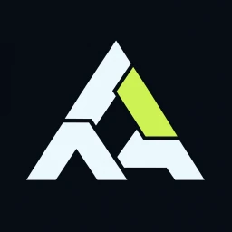
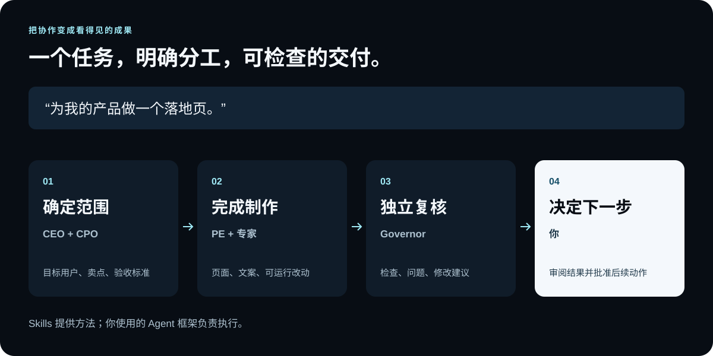
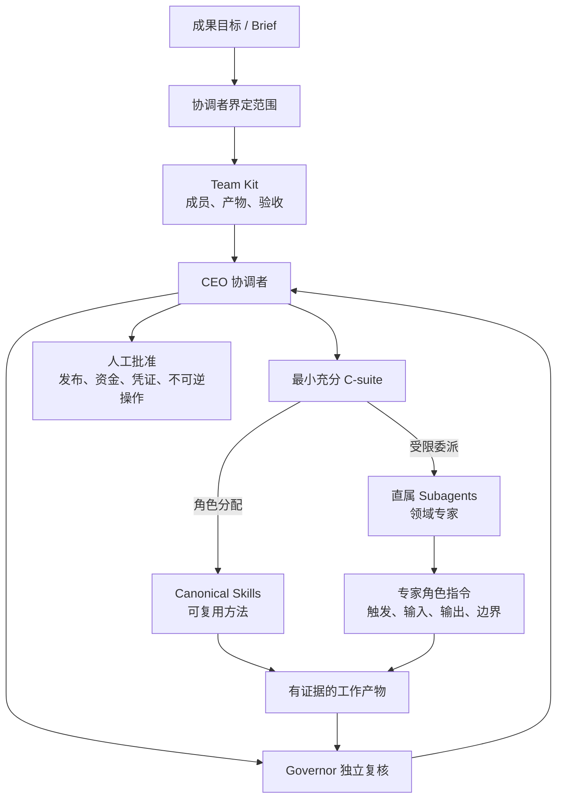
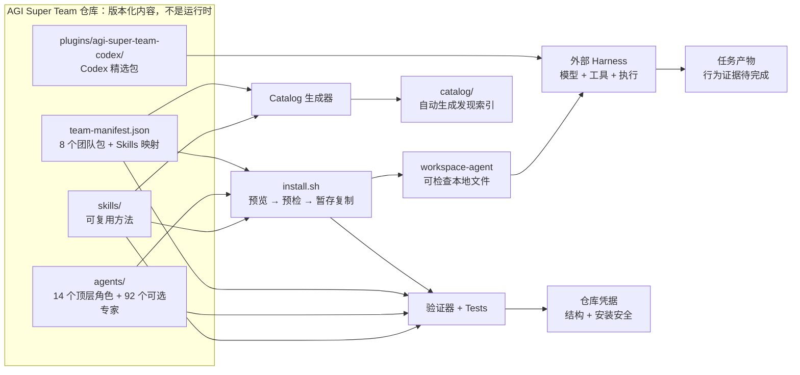

<p align="right"><a href="./README.md">English</a> · <a href="./README.es-ES.md">Español</a></p>

<p align="center">
  
</p>

<p align="center"></p>

<h1 align="center">AGI Super Team</h1>

<p align="center"><strong>面向本地 AI Agent 框架的、有组织、可安装的 Agents + Skills 团队系统。</strong></p>

<p align="center">
  从一个成果开始：CEO 路由高管，高管调度专家，Skills 提供方法，Governor 独立验收。
</p>

AGI Super Team 不是 Codex 专属插件，而是一套版本化、有组织的 **Agents + Skills 团队系统**。它通过 19 个明确适配器，服务 Claude Code、Codex、OpenClaw、Hermes 等主流本地 AI Agent 框架。

同一套组织契约可以跨框架落地：14 个顶层角色、92 个可选直属专家、可复用 Skills、8 支成果型 Team、独立审查与明确人工批准。不同适配器只负责映射目标框架真实支持的能力。

## 一个真实任务，团队具体做什么？

例如你说：“为我的产品做一个落地页。”团队将任务拆成简报、页面文件和可检查的评审结果。下面展示协作方式，不代表已经完成的运行记录。



| 你想做什么 | 可以期待的交付物 | 选择 Team |
|---|---|---|
| 做一个产品 | 产品简报 → 实现文件 → 评审记录 | [product-delivery](./starter-kits/product-delivery/) |
| 做一组内容 | 来源笔记 → 分渠道成稿 → 主张核验 | [content-creator](./starter-kits/content-creator/) |
| 研究一个决策 | 研究问题 → 证据地图 → 决策备忘录 | [research-decision](./starter-kits/research-decision/) |

[**浏览官网 →**](https://aaaaqwq.github.io/AGI-Super-Team/)

**版本说明：** 这里刻意不写具体版本号——写死的数字下一次发版就会过期。`@latest` 安装的是 npm 当前发布的版本，可能与本仓库源码不一致。请自行核对，不要相信文档里的数字：

```bash
npm view agi-super-team version               # `@latest` 实际解析到的版本
node -p "require('./package.json').version"   # 本仓库源码版本
```

`latest` 以外的 dist-tag 不保证指向当前版本。关于一次源码与 registry 不一致的带日期案例及其恢复步骤，见 [1.5.0 发布诊断](./docs/guides/npm-release-status.md)。

<a id="coding-agent-quick-start"></a>
## ⚡ 用 Coding Agent 一键安装

把下面整段提示词粘贴给 Claude Code、Codex、OpenClaw 或其他 Coding Agent。它只授权在安全预览通过后安装。

```text
把 https://github.com/aAAaqwq/AGI-Super-Team 安装到当前 Coding Agent 环境。

1. 识别当前客户端，并运行 `npx -y agi-super-team@latest --list-tools`。
2. 只选择一个准确匹配的 Adapter；本次安装绝不使用 `--all-tools`。
3. 如果当前客户端支持原生子 Agent，则加入 `--all-subagents`；否则省略并说明限制。
4. 先运行不含 `--install` 的预览，展示实际解析的版本、目标目录、受管理文件和冲突。
5. 目标明确且预览干净时，用相同选择运行 `--install --connect`，再单独运行 `--doctor`。
6. 如果存在非托管文件覆盖、凭证需求、框架或目标目录不明确，立即停止，不得猜测。
7. 汇报安装内容、是否支持原生委派，以及是否需要重启客户端或新建任务。
```

这是“一段提示词完成安装”，不是盲装。目标不明确、目录不安全或发生冲突时仍会停止。

## 🐝 用 Swarm agents 召集军团

安装后重启客户端或新建任务，再使用这段可复用提示词：

```text
Swarm agents: <你的目标>

作为 CEO 协调者：
- 定义成果和验收检查。
- 选择最小充分团队。
- 只并发处理相互独立的工作，并明确文件所有权。
- 用 Skills 提供方法，交给独立 Governor 审查。
- 最终综合为一个经过验证的结果。

如果当前环境不支持原生多 Agent 委派，就按同一角色方案顺序执行并如实说明。未经我批准，不得发布、部署、付费、使用凭证或执行不可逆操作。
```

`Swarm agents:` 是路由提示，不代表无限并发。实际并发数、嵌套深度、工具和模型权限由当前框架决定。

<a id="安装到你的-agent-框架"></a>
## 🛠️ 手动 CLI 安装

先列出全部 19 个适配目标，再预览一个目标，确认后用同一选择安装：

```bash
npx -y agi-super-team@latest --list-tools
npx -y agi-super-team@latest --tool claude-code
npx -y agi-super-team@latest --tool claude-code --install --connect
npx -y agi-super-team@latest --tool claude-code --doctor
```

以上命令直接使用公开 npm 包。自动化场景不要把 `@latest` 留在固定流水线里：先解析出确切的已发布版本再固定它，这样后续发版不会改变本次安装内容：

```bash
AGI_VERSION="$(npm view agi-super-team version)"
npx -y "agi-super-team@${AGI_VERSION}" --tool claude-code --install --connect
```

npm 发行包保留可发现的 `SKILL.md` 入口，并完整携带 `config/team-manifest.json` 实际分配的所有 Skills。经过来源审查的第一方作品可在 [Daniel 的原创 Skills](./skills/original/) 分类中查看；如果需要整个 Skill 库的全部辅助素材，请克隆仓库。

把 `claude-code` 换成 `--list-tools` 输出的目标 ID。只有在确实要同时写入全部全局和项目适配目标时，才使用 `--all-tools`。不带参数仍保留旧版 Codex 预览行为；新脚本应明确写出 `--tool` 或 `--all-tools`。

### 五个主力框架

| 平台 | 预览命令 | 安装能力 |
|---|---|---|
| **Claude Code** | `npx -y agi-super-team@latest --tool claude-code` | 原生 Markdown Agent + canonical Skills + Claude orchestrator |
| **Codex** | `npx -y agi-super-team@latest --tool codex` | 主会话 CEO + 原生 TOML Agent + canonical Skills |
| **OpenClaw** | `npx -y agi-super-team@latest --tool openclaw` | 命名空间化 Agent Workspace + canonical Skills + 安全配置合并 |
| **Hermes Agent** | `npx -y agi-super-team@latest --tool hermes` | 角色 Skill + canonical Skills + Profiles/Kanban 蓝图 |
| **DeepSeek Harness** | `npx -y agi-super-team@latest --tool dsh` | 声明式 cordis patch 启用技能根 + AGENTS.md CEO 块 + preset |

`--install` 负责落盘；`--install --connect` 还会生成接线凭据。OpenClaw 会先 dry-run，再按 `id` 合并 `agents.list`，保留非托管 Agent，且不创建 channel binding。Claude/Codex 采用文件系统发现；Hermes 只生成 Profile 蓝图，不自动创建 Profile、Cron 或 Gateway。完整路径、权限和 receipt 契约见[五个主力框架 Adapter 接入手册](./docs/guides/harness-adapters.md)。

OpenClaw `2026.7.1-2` 要求 Node.js `>=22.22.3 <23`、`>=24.15.0 <25` 或 `>=25.9.0`。AGI Super Team 本身仍支持 Node.js 18+；这个更严格的条件只在调用当前 OpenClaw CLI 时适用。

Claude Code、Codex、OpenClaw、Hermes 都是同一套团队系统的一等入口，不是组织结构不同的四个版本。由于各框架的原生 Agent 与 Skill 能力不同，最终交付形态会有所区别。

### 安装高管子 Agent 军团

默认仍只安装 14 个顶层角色。按需增加一个直属军团，或一次安装全部 92 个专家：

```bash
# 先预览，再把相同命令加上 --install
npx -y agi-super-team@latest --tool codex --with-subagents cto
npx -y agi-super-team@latest --tool codex --with-subagents cfo --with-subagents clo
npx -y agi-super-team@latest --tool codex --all-subagents --install
```

组织关系采用三层金字塔：CEO → 11 位管理型高管 → 直属叶子。CTO 另外引用现有 PE 作为生产交付负责人，不复制第二份 PE 身份。92 份 `agents/<高管>/subagents/<角色>/AGENTS.md` 均从 `jnMetaCode/agency-agents-zh` 固定提交逐字复制；本项目的触发、排除、输入、交付、验收与安全边界单独维护，不改写上游原文。来源链接和 SHA-256 见 [`config/agent-sources.lock.json`](./config/agent-sources.lock.json)。CEO 保留总协调权，Governor 保持独立审查，PE 仍是 CTO 引用的生产交付叶子，三者都不再向下复制一套专家。

| 管理者 | 直属角色 | 路由重点 |
|---|---:|---|
| CTO | 22 个工程专家 + canonical PE | 窄领域不确定性先交专家；已批准的跨模块生产交付交 PE |
| CPO | 3 个设计专家 | 未知用户问题 → UX 研究；未知结构 → UX 架构；结构已定 → UI 设计 |
| CCO | 19 个内容增长专家 | 先按工作对象、平台、生产阶段消歧；一个主责，最多一个协作 |
| CFO | 8 个财务专家 | 核算、FP&A、预测、税务、反欺诈与定价分别路由 |
| CDO | 5 个数据专家 | 数据修复、整合、提取与身份图谱分责 |
| CQO | 4 个量化专家 | 投资研究、模型 QA、实验追踪与空间数据分析分责 |
| CMO | 7 个营销专家 | 品牌、本地化、公关、邮件、付费投放与归因分责 |
| CRO | 6 个研究专家 | 趋势、反馈、社媒、新闻、搜索词与证据收集分责 |
| CSO | 8 个销售专家 | 发现、外呼、售前、交易、提案、管线、成功与大客户分责 |
| COO | 4 个运营专家 | 日常运营、项目推进、变革与会议行动项分责 |
| CLO | 6 个法务合规专家 | 合同、政策、隐私、文档、AI 治理与医疗营销合规分责 |

Codex 的嵌套调用需要 `max_depth = 2`。在 `max_threads = 4` 下，一次只运行一个管理者波次：CEO + 一个高管 + 最多两个直属叶子。若深度仍为 1，由 CEO 平铺调用同一专家并如实标记降级，不声称高管完成了嵌套委派。

这里列出的是 **19 个 AI 客户端/运行时适配目标**，不是 19 个功能相同的 CLI。适配器可能安装原生 Agent、原生 Skill、项目规则/上下文，或把角色包降级为 Agent-as-Skill。文件写入成功不等于当前客户端已经加载或执行这些内容。

### 19 个适配目标矩阵

全局适配器通常从所选 OS Home 基准解析；项目适配器从所选项目目录解析。OpenClaw 与 Hermes 会优先遵循各自的原生运行时根目录，见下表。

| ID | 客户端/运行时 | 范围 | Agent 交付方式 | Skill 交付方式 | 状态 |
|---|---|---|---|---|---|
| `claude-code` | Claude Code | 全局 | 原生 Markdown Agent：`.claude/agents` | canonical：`.claude/skills` | 结构接入；Runtime pending |
| `codex` | Codex | 全局 | 主会话 CEO + TOML：`.codex/agents` | canonical：`.agents/skills` | 结构接入；Runtime pending |
| `openclaw` | OpenClaw | 全局 | 原生 Workspace：`<当前配置目录>/agency-agents/agi-super-team` | canonical：`<当前配置目录>/skills/agi-super-team` | 结构接入；Runtime pending |
| `hermes` | Hermes Agent | 全局 | 角色 Skill：`$HERMES_HOME/skills/agi-super-team-agents` | canonical：`$HERMES_HOME/skills/agi-super-team` | 蓝图接入；Runtime pending |
| `dsh` | DeepSeek Harness | 全局 | Preset：`.dsh/.agent-presets/ast-team` | canonical：`.dsh/skills/agi-super-team` | 结构接入；Runtime pending |
| `copilot` | GitHub Copilot | 全局 | Markdown Agent：`.github/agents`、`.copilot/agents` | 原生：`.copilot/skills` | 适配器 |
| `antigravity` | Antigravity | 全局 | Agent：`.gemini/config/agents` | 原生：`.gemini/config/skills` | **实验性** |
| `gemini-cli` | Gemini CLI | 全局 | Markdown Agent：`.gemini/agents` | 原生：`.gemini/skills` | 适配器 |
| `opencode` | OpenCode | 全局 | Markdown Agent：`.config/opencode/agents` | 原生：`.config/opencode/skills` | 适配器 |
| `cursor` | Cursor | 全局 | Markdown Agent：`.cursor/agents` | 原生：`.cursor/skills` | **实验性** |
| `trae` | Trae | 项目 | 项目规则：`.trae/rules` | 原生：`.trae/skills` | 项目适配器 |
| `aider` | Aider | 项目 | 合并项目规则：`CONVENTIONS.md` | 合并进同一项目上下文 | 项目适配器 |
| `windsurf` | Windsurf | 项目 | 合并项目规则：`.windsurfrules` | 合并进同一项目上下文 | 项目适配器 |
| `qwen` | Qwen Code | 全局 | Markdown Agent：`.qwen/agents` | 原生：`.qwen/skills` | 适配器 |
| `deerflow` | DeerFlow | 项目 | Agent-as-Skill：`skills/custom/agi-super-team-agents` | 原生：`skills/custom/agi-super-team` | 项目适配器 |
| `workbuddy` | WorkBuddy | 全局 | Agent-as-Skill：`.workbuddy/skills/agi-super-team-agents` | 原生：`.workbuddy/skills/agi-super-team` | 适配器 |
| `codewhale` | CodeWhale | 全局 | Agent-as-Skill：`.codewhale/skills/agi-super-team-agents` | 原生：`.codewhale/skills/agi-super-team` | 适配器 |
| `kiro` | Kiro | 全局 | Markdown Agent：`.kiro/agents` | 原生：`.kiro/skills` | 适配器 |
| `qoder` | Qoder | 全局 | Markdown Agent：`.qoder/agents` | 原生：`.qoder/skills` | 适配器 |

矩阵描述的是 [`config/cli-adapters.json`](./config/cli-adapters.json) 中的适配契约，并不表示 19 个客户端都做过运行时验证。Cursor 与 Antigravity 明确处于实验状态。

复杂任务可直接使用 canonical [`orchestrate-agi-super-team`](./skills/orchestrate-agi-super-team/SKILL.md) Skill，执行 Team → C-suite → Skills/Subagents → Governor → CEO → 人工批准的完整流程。它会识别当前框架的真实委派限制，并记录平铺或顺序降级，不伪称发生了原生嵌套。

### 指定目录、刷新与验证

`--home` 用于重定向 OS Home 基准，`--project-dir` 用于项目范围目标（默认是当前目录）。Hermes 优先读取非空的 `HERMES_HOME`；OpenClaw 遵循 `OPENCLAW_HOME`、`OPENCLAW_STATE_DIR` 与 `OPENCLAW_CONFIG_PATH`。如果显式 `--home` 与运行时覆盖变量冲突，安装器会在写入前拒绝执行。可用临时目录完成一次隔离审计：

```bash
AGI_AUDIT_HOME="$(mktemp -d "${TMPDIR:-/tmp}/agi-super-team-home.XXXXXX")"
AGI_AUDIT_PROJECT="$(mktemp -d "${TMPDIR:-/tmp}/agi-super-team-project.XXXXXX")"

npx -y agi-super-team@latest --tool openclaw \
  --home "$AGI_AUDIT_HOME" --project-dir "$AGI_AUDIT_PROJECT"
npx -y agi-super-team@latest --tool openclaw \
  --home "$AGI_AUDIT_HOME" --project-dir "$AGI_AUDIT_PROJECT" --install
npx -y agi-super-team@latest --tool openclaw \
  --home "$AGI_AUDIT_HOME" --project-dir "$AGI_AUDIT_PROJECT" --doctor
```

以后用同一条 `--install` 命令刷新受管理内容，再运行一次 `--doctor`。需要更新接线和 pending receipt 时使用 `--install --connect`。随后重启目标客户端或新建任务，确认它发现了预期 Agent/Skill。`--doctor` 检查的是已安装的适配产物，不验证模型行为或任务质量。

### 安全与更新边界

- 默认只预览且不写文件；`--install` 是明确的写入边界。
- 对相同选择重复执行按幂等设计。不同的受管理目标会先备份再替换；选择范围外的客户端文件不归安装器管理。
- 本地备份只用于辅助恢复，不是完整快照或卸载系统。重要配置仍应纳入自己的版本控制或文件系统备份。
- 安装器拒绝符号链接等不安全目标；需要缩小范围时可使用 `--no-agents` 或 `--no-skills`。
- 本项目不提供远程脚本管道安装方式；上方命令使用 npm package runner，但仍应按常规审查依赖。
- 安装只证明文件已生成；当前五个主力 Adapter 的运行证据都保持 `pending`，直到 clean client canary 与干净 revision 匹配。

适配器设计部分参考了 [`jnMetaCode/agency-agents-zh`](https://github.com/jnMetaCode/agency-agents-zh) 的固定提交 [`2ecfabf8`](https://github.com/jnMetaCode/agency-agents-zh/commit/2ecfabf8e944ccdfed63ad8c44d5241290af6977)。AGI Super Team 在本仓库独立维护 Manifest、Payload 映射、安全行为和证据边界。

<p align="center">
  <a href="#coding-agent-quick-start"><strong>安装团队</strong></a>&nbsp;&nbsp;|&nbsp;&nbsp;
  <a href="./.codex/INDEX.md">查看 Codex 包</a>
</p>

## 🧠 一分钟理解整个系统

| 层级 | 你会得到什么 | 为什么有用 |
|---|---|---|
| **🧩 Skills** | 按 14 类成果组织的权威实体 `SKILL.md` | 为重复任务复用聚焦方法，不必每次重写指令 |
| **🤖 Agents** | 14 个顶层角色包 + 92 个可选直属专家，包含人格、工作流、精确路由和来源锁 | 让规划、工程、产品、内容、研究和审查拥有明确负责人 |
| **🔁 Team Packs** | 8 个由 manifest 驱动的成果型 Team，覆盖 Solo Founder 到 Full Team | 围绕成果启用最小充分团队，而不是一开始加载全部角色 |

<p>
  <a href="https://github.com/aAAaqwq/AGI-Super-Team/actions/workflows/validate-repository.yml"></a>
  <a href="./LICENSE"></a>
  
</p>

Team、C-suite、Subagent 与 Skill 不是目录继承链，而是一张成果驱动的连接图：Team 选择最小充分的 C-suite；每位高管一条支路获得专属 Skills，另一条支路获得允许调用的直属专家；所有产物最后进入独立 Governor 验收。



Skills 与 Subagents 是 C-suite 下的两条并行能力支路，不是 `Subagent → Skill` 的自动继承关系。完整的配置编译过程、运行时委派时序、框架差异和安全不变量见 [Team、C-suite、Subagent 与 Skill 的连接原理](./docs/guides/team-agent-skill-architecture.md)。

AGI Super Team 负责版本化内容、选择规则、安全复制和仓库检查。你另行配置的编程 Agent 工具负责模型、凭据、工具、执行和最终任务产物。

## 🎯 从一个成果开始

先选择与成果匹配的军团。每支 Team 都包含 CEO 协调者、范围明确的高管核心、独立 Governor 验收门，并可在出现明确证据缺口时增加其他高管或直属专家。

| Team 军团 | 提供给它 | 预期评估产物 | 核心团队 |
|---|---|---|---|
| [🚀 Solo Founder](./starter-kits/solo-founder/) | 有边界的产品想法或发布 Brief | 产品决策、测试优先计划、发布证据、Governor 结论 | CEO、CPO、PE、Governor |
| [✍️ Content Creator](./starter-kits/content-creator/) | 已批准素材、受众与渠道 | 证据 Brief、渠道内容、衡量计划、声明审查 | CEO、CRO、CCO、CMO、Governor |
| [📊 Quant Research](./starter-kits/quant-trader/) | 研究假设与历史数据 | 可复现回测规范、风险备忘录、独立验收 | CEO、CQO、CDO、CFO、Governor |
| [🧱 Product Delivery](./starter-kits/product-delivery/) | 已验证用户问题与交付约束 | 产品 Brief、架构决策、已测试改动、发布交接 | CEO、CPO、CTO、PE、Governor |
| [🔬 Research Decision](./starter-kits/research-decision/) | 重大问题与决策标准 | 研究计划、证据地图、带引用综合、决策备忘录 | CEO、CRO、CDO、Governor |
| [📣 Go To Market](./starter-kits/go-to-market/) | 已验证定位与上市/营收目标 | 定位 Brief、上市资产、营收实验、风险门禁 | CEO、CPO、CMO、CCO、CSO、Governor |
| [🚨 Operations Response](./starter-kits/operations-response/) | 有边界的事故或交付失败 | 事故范围、遏制方案、恢复证据、事后复盘 | CEO、COO、CTO、PE、Governor |
| [🏛️ Executive Team](./starter-kits/full-team/) | 跨职能公司级 Brief | 高管路由计划、专家产物、独立审查、验证交接 | 全部 14 个顶层角色可用；CEO 协调、Governor 审查 |

优先选择能够完整负责成果的最小军团。`full-team` 会让全部 14 个顶层角色进入可选范围，但 CEO 仍只调度 Brief 有充分理由需要的角色与专家。

## ⚡ 旧版通用工作区生成器

上方多客户端 npm 安装器是主要入口。需要与具体客户端无关、可直接检查的角色工作区时，旧版 `install.sh` 仍然有用。克隆 `main` 并预览 Solo Founder；默认只预览，不会写入文件：

```bash
git clone --depth 1 --branch main https://github.com/aAAaqwq/AGI-Super-Team.git
cd AGI-Super-Team
git rev-parse HEAD
./install.sh --source "$PWD" --destination /path/to/review-workspace solo-founder
```

检查所选 Agents 和目标位置，确认符合预期后再应用：

```bash
./install.sh --source "$PWD" --destination /path/to/review-workspace --apply solo-founder
```

通用安装器会在发布暂存工作区前验证全部必需文件。它会保留已有的人格和技能文件，并拒绝危险的来源或目标符号链接。依赖、更新和恢复方法见 [setup.md](./setup.md)。

Manifest 会把可移植的 `required`/`optional` Skills、仅适用于特定 Harness 的 `harnessSpecific` 目录项，以及未内置的外部推荐明确分开。通用安装只复制通过当前 portability contract 的类别，并扫描完整 payload 中已知的宿主路径与运行时专用命令。

**成功标准：** 预览不写入任何文件；应用会创建三个可检查的角色工作区，并且不覆盖已有文件。

## ✨ 按来源浏览 Skills

先选择你能接受的来源边界，再按成果查找。来源标签表示已审查的来源证据，不等于运行时验证。

| [项目原创](./catalog/#project-original-skills) | [适配改造](./catalog/#adapted-skills) | [来源收录](./catalog/#collected-skills) | [来源待核](./catalog/#unknown-origin-skills) |
|---|---|---|---|
| 有摘要凭据的第一方作品 | 基于明确来源修改 | 保留自明确来源 | 等待来源审查 |

## 🧭 按成果浏览技能

根 README 只保留精选入口。需要完整、可检索库存时，请使用自动生成的 catalog。

| 构建与运行 | 获客与创作 | 决策与自动化 |
|---|---|---|
| [🤖 AI Agents 与编排](./catalog/#ai-agents-orchestration) | [📈 营销、SEO 与增长](./catalog/#marketing-seo-growth) | [📊 数据、分析与研究](./catalog/#data-analytics-research) |
| [💻 软件工程](./catalog/#software-engineering) | [✍️ 内容、媒体与发布](./catalog/#content-media-publishing) | [🧭 业务运营与战略](./catalog/#business-operations-strategy) |
| [☁️ 云、DevOps 与可靠性](./catalog/#cloud-devops-reliability) | [🤝 销售、CRM 与客户成功](./catalog/#sales-crm-customer-success) | [⚙️ 应用与工作流自动化](./catalog/#apps-workflow-automation) |
| [🛡️ 安全、隐私与法律](./catalog/#security-privacy-legal) | [🎨 产品、设计与 UX](./catalog/#product-design-ux) | [💹 金融、交易与市场](./catalog/#finance-trading-markets) |
| [🧰 专业领域与通用工具](./catalog/#general-utilities) | [🇨🇳 中文平台工作流](./catalog/#chinese-platform-workflows) | |

按所需深度继续探索：

| 入口 | 最适合 |
|---|---|
| [Skills 概览](./skills/) | 支持等级、范围明确的起点和发现方式 |
| [自动生成的技能目录](./catalog/) | 按任务成果组织全部权威实体技能 |
| [Agents](./agents/) | 人格、身份、工作流和工具指南 |
| [实用指南](./docs/guides/) | Codex、Claude Code、兼容性、团队选择和工作边界 |
| [专题手册](./cookbook/) | 内容、提示词、研究和量化工作流的深入材料 |
| [架构地图](./ARCHITECTURE.md) | 事实来源、生成产物、公开入口和变更责任 |
| [Team / Agent / Skill 连接原理](./docs/guides/team-agent-skill-architecture.md) | Team 选人、Manager 路由、Skill 分配、Adapter 编译与运行时委派 |
| [统一术语](./CONTEXT.md) | Module、Interface、Adapter、证据与产品术语 |

### 🔎 查找高质量 Skill 来源

[`agent-skill-repository-index`](./skills/agent-skill-repository-index/) 把 Daniel 审核过的来源清单变成安全选择流程。先比较一个候选项并检查权限和来源，再安装或移除它，而不是全局激活整个仓库。

| 需求 | 维护中的参考资料 |
|---|---|
| 比较审核来源 | [来源矩阵](./skills/agent-skill-repository-index/references/repositories.md) |
| 检查带日期的热度信号 | [Star 快照](./skills/agent-skill-repository-index/references/star-snapshot.md) |
| 安全安装单个候选项 | [安装流程](./skills/agent-skill-repository-index/references/installing.md) |

Star 只用于发现，不等于可信。矩阵记录 `DAILY`、`LIBRARY` 和 `QUARANTINE` 边界；聚合目录和运行时不会被批量安装。

## ✅ 今天已经实用的部分

你已经可以浏览确定性技能目录、检查每个 Agent 指令、预览 manifest 选择的团队，并在不覆盖已有文件的前提下组装本地角色工作区。

| 主张 | 证据 | 状态 |
|---|---|---|
| 仓库库存、数量和引用 | `npm run validate -- --warnings-as-errors` | **当前 checkout 已验证** |
| 通用安装器的预览、预检、no-clobber 和暂存 | `npm test` | **当前 checkout 已验证** |
| 自动生成目录覆盖权威库存 | `npm run check:skills` | **当前 checkout 已验证** |
| 主成果分类与固定独立复核集一致 | [Gold Set 方法](./docs/skill-taxonomy-gold-set.md) + [生成报告](./catalog/skill-taxonomy-evaluation.json) | **当前 checkout 的复核集门禁已通过** |
| 尚无匹配凭据的适配器在客户端中的加载 | 与版本匹配的 Harness Receipt | **Validation pending** |
| 任务质量或商业成果 | 公开 fixture、基线、评估规则和产物 | **Validation pending** |

## 🧾 可复现安装凭据

创建一次性目标目录，证明预览没有写入，再应用并验证 Solo Founder 的三个预期工作区：

```bash
AGI_SOLO_DEST="$(mktemp -d "${TMPDIR:-/tmp}/agi-solo-founder.XXXXXX")"

./install.sh --source "$PWD" --destination "$AGI_SOLO_DEST" solo-founder
test -z "$(find "$AGI_SOLO_DEST" -mindepth 1 -print -quit)"

./install.sh --source "$PWD" --destination "$AGI_SOLO_DEST" --apply solo-founder
test -f "$AGI_SOLO_DEST/workspace-ceo/SOUL.md"
test -f "$AGI_SOLO_DEST/workspace-pe/SOUL.md"
test -f "$AGI_SOLO_DEST/workspace-cco/SOUL.md"

python3 -m venv .venv
. .venv/bin/activate
python -m pip install --requirement requirements-dev.txt
npm test
npm run validate -- --warnings-as-errors
npm run check:skills
npm run check:taxonomy-evaluation
npm run check:architecture
```

这份凭据证明当前 checkout 和目标状态下的 manifest 选择、预览安全、暂存复制和仓库完整性。它不能证明工具加载、任务质量或商业成果。

<details>
<summary><strong>👀 查看 preview → apply → verify 分镜</strong></summary>

<p align="center">
  
</p>

动画使用脱敏路径，仅为演示 storyboard，不是运行证据。可阅读[分镜文字稿](./assets/demo-install.txt)。

</details>

## 🔌 选择分发方式

为指定 Agent 框架安装时，优先使用[一段提示词安装](#coding-agent-quick-start)，也可以使用上方的 19 目标 npm CLI。

需要 Codex 专用细节时查看 [Codex 精选包](./.codex/INDEX.md)；需要与客户端无关的文件时使用旧版通用工作区生成器。

[Claude Code 指南](./docs/guides/claude-code-install.html)与[客户端兼容说明](./docs/guides/harness-compatibility.html)提供补充背景。支持状态以当前 Adapter Manifest 和与 commit 匹配的凭据为准。

通用路径需要 Bash 与 Node.js；仓库验证还需要 npm 与 Python 3。操作系统和客户端版本支持范围以 CI 和已发布凭据为准。存在适配文件永远不代表功能完全一致。

## 🗂️ 仓库架构



| 文件或目录 | 职责 |
|---|---|
| [`config/team-manifest.json`](./config/team-manifest.json) | Agents、团队包，以及可移植、Harness 专用和外部 Skill assignment 的事实源 |
| [`config/repository-architecture.json`](./config/repository-architecture.json) | 机器可读的 Modules、路径责任、生成 lineage 与 Adapter 状态 |
| [`agents/`](./agents/) 与 [`skills/`](./skills/) | 人工编写、版本化输入；只有 manifest 标记为可移植的 payload 会进入通用工作区 |
| [`docs/guides/team-agent-skill-architecture.md`](./docs/guides/team-agent-skill-architecture.md) | Team、C-suite、Subagent、Skill、Governor 与人工批准的连接原理 |
| [`.codex/INDEX.md`](./.codex/INDEX.md) | 安装指南和 Codex 包索引 |
| [`plugins/agi-super-team-codex/`](./plugins/agi-super-team-codex/) | 实际的 Codex 插件、Skills 和内置 Agent 角色 |
| [`install.sh`](./install.sh) | 默认预览、选择、预检、暂存和 no-clobber 发布 |
| [`scripts/repository_model.py`](./scripts/repository_model.py) | 验证与生成共用的库存及 manifest 模型 |
| [`catalog/`](./catalog/) | 自动生成的发现输出，不是库存事实源 |
| [`tests/`](./tests/) | 仓库、安装器、站点数据和 SEO 契约 |
| [`docs/`](./docs/) | 项目站、验证数据和人工编辑指南 |

关于 authored input、generated output、分发和证据边界，请阅读完整的[仓库架构地图](./ARCHITECTURE.md)、[统一术语](./CONTEXT.md)与[决策记录](./docs/adr/)。

[`config/external-skill-sources.json`](./config/external-skill-sources.json) 记录已删除机器本地链接的 tombstones，其中也包括尚未解析的来源字段。README 文案和自动生成目录都不是库存事实源。

## 🧠 团队拓扑

```text
创始人 / 操作者
└── CEO：协调与质量门禁
    ├── CTO / PE：架构与实现
    ├── CPO / CCO / CMO：产品、内容与增长
    ├── CQO / CFO / CDO：量化研究、财务与数据
    ├── CLO / CRO / CSO / COO：法律、研究、销售与运营
    └── Governor：独立审查与升级
```

导师姓名只用于创作框架，不代表关联、背书或保证模仿效果。

## 🛡️ 边界与人工批准

AGI Super Team 不是模型、自治编排器或 Agent 运行时。安装文件不会让某个工具自动加载或执行它们。

- 执行前检查第三方命令和依赖。
- 不要在 Skill 或 issue 中放入凭据、私人数据、浏览器会话或生产配置。
- 金融工作流在独立验证前仅用于研究或模拟交易。
- 帖子、消息、交易、部署和破坏性操作必须经过人工明确批准。
- 安全漏洞请通过 [GitHub Security Advisories](https://github.com/aAAaqwq/AGI-Super-Team/security/advisories/new) 私密报告。

## 🤝 贡献与求助

- [提交可复现 Issue](https://github.com/aAAaqwq/AGI-Super-Team/issues/new/choose)
- [贡献与来源要求](./CONTRIBUTING.md)
- [安装与恢复](./setup.md)
- [安全政策](./SECURITY.md)
- [MIT 许可证](./LICENSE)

仓库中有八份派生数据（技能 catalog、agent 索引、harness 包、质量与分类评估报告等）由 `skills/` 与 `config/` 生成并入库。每份克隆后执行一次，启用 pre-commit hook，让改动这两个目录时自动重新生成、而不是放任漂移：

```bash
git config core.hooksPath .githooks
```

hook 会在提交触及 `skills/` 或 `config/` 时运行 `npm run build:all`，把重写的产物重新 `git add`；任一生成器失败、或改动把某项指标顶破质量基线的棘轮上限，都会阻断提交。它**默认不生效**——`core.hooksPath` 属于每份克隆的本地配置——所以克隆后请执行上面这条命令。两类守卫与手动回退方式见 [CONTRIBUTING.md](./CONTRIBUTING.md)。

## ⭐ GitHub Stars

查看 AGI Super Team 的公开 Star 趋势。动态图由 Star History 提供；点击图表可打开交互式时间线。

<p align="center">
  <a href="https://www.star-history.com/?type=date&amp;legend=top-left&amp;repos=aAAaqwq%2FAGI-Super-Team">
    
  </a>
  <br>
  <sub>动态图由 Star History 提供 · <a href="https://github.com/aAAaqwq/AGI-Super-Team/stargazers">在 GitHub 查看 Stargazers</a></sub>
</p>

如果 AGI Super Team 确实帮你省下了时间，欢迎顺手 [Star 本仓库](https://github.com/aAAaqwq/AGI-Super-Team)，方便以后回来查看。
