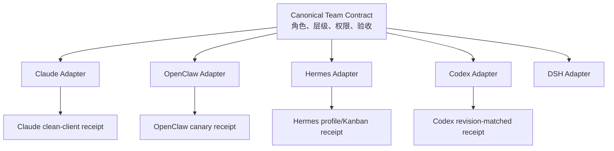

# 五个主力框架 Adapter 接入手册

AGI Super Team 只有一份 canonical Team Contract：`agents/` 定义角色与层级，`skills/` 定义可复用方法，Manifest 定义分配关系。Claude Code、Codex、OpenClaw、Hermes、DeepSeek Harness 的外置 Adapter 只负责翻译和安装，不反向修改 canonical 内容。

Team 如何选择 C-suite、Manager 如何限制直属专家，以及 Skills 为什么不是 Subagent 的自动继承链，见 [Team、C-suite、Subagent 与 Skill 的连接原理](./team-agent-skill-architecture.md)。需要直接执行这套流程时，调用 [`orchestrate-agi-super-team`](../../skills/orchestrate-agi-super-team/SKILL.md)。



## 统一安装流程

先预览，再安装；只有需要写入框架配置或生成接线凭据时才加 `--connect`：

```bash
npx -y github:aAAaqwq/AGI-Super-Team --tool claude-code --all-subagents
npx -y github:aAAaqwq/AGI-Super-Team --tool claude-code --all-subagents --install --connect
npx -y github:aAAaqwq/AGI-Super-Team --tool claude-code --all-subagents --doctor
```

把 `claude-code` 换成 `codex`、`openclaw`、`hermes` 或 `dsh`。默认只安装 14 个 canonical 角色；`--with-subagents <高管>` 安装一组直属专家，`--all-subagents` 安装全部 92 个专家。

`--connect` 必须和 `--install` 同时使用。安装器会把不同的受管理目标先备份再替换，拒绝符号链接目标。它不会删除选择范围外的 Agent/Skill。

## Adapter 落盘与接线

| 框架 | Agent/角色产物 | canonical Skills | 接线行为 |
|---|---|---|---|
| Claude Code | `~/.claude/agents/ast-*.md` | `~/.claude/skills/<skill>` | 文件系统发现；生成 Claude `Agent` 工具专用 orchestrator |
| Codex | `~/.codex/AGENTS.md` 受管理 CEO 块 + `~/.codex/agents/ast-*.toml` | 官方 `~/.agents/skills/<skill>` | 当前主会话是 CEO，不生成第二个 CEO Agent；其余角色使用 TOML |
| OpenClaw | `<当前配置目录>/agency-agents/agi-super-team/ast-*` | `<当前配置目录>/skills/agi-super-team/<skill>` | `--connect` 先 dry-run，再按 `id` 合并 `agents.list`，保留非托管 Agent，不创建 channel binding |
| Hermes | `$HERMES_HOME/skills/agi-super-team-agents/ast-*/SKILL.md` + Profile 蓝图 | `$HERMES_HOME/skills/agi-super-team/<skill>` | 生成 Profiles + Kanban 蓝图；不自动创建 Profile、Cron 或 Gateway |
| DSH | `$DSH_HOME/AGENTS.md` 受管理 CEO 块 + `$DSH_HOME/.agent-presets/ast-team/`（`agent.cordis.yml` / `preset.yml`） | `$DSH_HOME/skills/agi-super-team/<skill>` | 写 `$DSH_HOME/profiles/<profile>/cordis.patch.yml` 启用被宿主禁用的 `skill-filesystem` 并配 `customSkillDirs`；无 per-role 工具边界 |

所有物理存在且已分配的 canonical Skills 均按字节复制。Agent 由目标 Adapter 按框架原生格式生成；canonical `agents/` 与 `skills/` 不会被改写。

### 原生根目录解析

- Hermes：非空 `HERMES_HOME` 是最终安装根；未设置时，POSIX 默认 `~/.hermes`，Windows 默认 `%LOCALAPPDATA%\hermes`。Skills 始终位于该根的 `skills/` 下。
- OpenClaw：有效 Home 遵循 `OPENCLAW_HOME`；state 遵循 `OPENCLAW_STATE_DIR`；配置文件遵循 `OPENCLAW_CONFIG_PATH`。managed Skills 与 Agent workspace 使用 OpenClaw 的当前配置目录：显式 state 优先，其次是显式配置文件所在目录，最后是默认 state。
- `--home` 表示 OS Home 基准，不会静默覆盖上述框架变量。两者显式冲突时，安装器在 Preview 阶段失败且不写文件。
- OpenClaw 接线事务会把解析后的 state 与配置文件路径同时传给官方 CLI，并只对该配置文件做快照、备份、校验与回滚。
- 单独设置 `OPENCLAW_PROFILE` 不等于调用官方 CLI 的 `--profile`，因此安装器不会据此猜测目录。Profile 用户应显式提供与该 Profile 一致的 `OPENCLAW_STATE_DIR` 和 `OPENCLAW_CONFIG_PATH`。
- 无显式覆盖时，安装器仍会发现目标版本支持的 `.clawdbot/{openclaw.json,clawdbot.json}` 旧配置和 state。若 `.openclaw` 尚不存在，Workspace、Skills、connection 与 receipt 会继续安装在 `.clawdbot`，避免下一次启动隐式切换 state、隐藏旧 credentials 或 sessions；不会创建第二份 `openclaw.json`。
- 若 `.openclaw` 已存在但配置仍只存在于 `.clawdbot`，安装器无法安全判断哪个 state 才是用户当前运行时，会在写入前失败并同时显示两个路径。先按实际 Profile 明确设置 `OPENCLAW_STATE_DIR` 与 `OPENCLAW_CONFIG_PATH` 再重试；安装器不会自动移动或删除 credentials、sessions 或旧目录。
- `config get` 若返回 `__OPENCLAW_REDACTED__`，或主配置包含 `$include`，`--connect` 会在 patch 前拒绝执行。前者不能安全整组回写，后者可能修改未纳入本地事务快照的 include 文件；这两类配置需人工接线。

版本化依据：Hermes 路径语义以官方 `v2026.8.3` 的 [`get_hermes_home()`](https://github.com/NousResearch/hermes-agent/blob/3c27eb6234bf91b8ceee9e9071591b31e9b148cb/hermes_constants.py#L53-L74) 与 [`get_skills_dir()`](https://github.com/NousResearch/hermes-agent/blob/3c27eb6234bf91b8ceee9e9071591b31e9b148cb/hermes_constants.py#L1302-L1304) 为准；`skills.external_dirs` 是[当前官方支持的配置](https://github.com/NousResearch/hermes-agent/blob/3c27eb6234bf91b8ceee9e9071591b31e9b148cb/website/docs/user-guide/features/skills.md#external-skill-directories)，但本 Adapter 不会替用户自动写入。该目录不是只读安全边界：Hermes 若拥有写权限，`skill_manage` 可以修改或删除其中内容；共享目录应使用文件系统只读权限，或放入隔离 Profile/toolset 并保留变更审计。OpenClaw 路径语义以官方 `v2026.7.1-2`（commit `0790d9f593ad30c940ed93b5872a8cf6d6f3cf8c`）的 [`OPENCLAW_HOME`](https://github.com/openclaw/openclaw/blob/0790d9f593ad30c940ed93b5872a8cf6d6f3cf8c/src/infra/home-dir.ts#L35-L63)、[`OPENCLAW_STATE_DIR` / `OPENCLAW_CONFIG_PATH`](https://github.com/openclaw/openclaw/blob/0790d9f593ad30c940ed93b5872a8cf6d6f3cf8c/src/config/paths.ts#L53-L225) 及[环境变量说明](https://docs.openclaw.ai/help/environment)为准。当前 OpenClaw CLI 还要求 Node.js `>=22.22.3 <23`、`>=24.15.0 <25` 或 `>=25.9.0`。

Hermes 与 OpenClaw 的静态 Adapter manifest 已升级为 `schemaVersion: 2`：v2 中所有产物路径都相对于解析后的框架原生根目录，不再把默认 `~/.hermes` 或 `~/.openclaw` 写进契约。运行时生成的 connection/receipt 仍使用各自独立的 v1 数据契约。

## 权限和委派边界

- 统一层级为 CEO → C-suite Manager → Leaf，最大深度为 2。
- 每个 Manager 最多两个并发直属叶子。
- Leaf 与 Governor 不得继续委派。
- Governor 独立复核，不能被工作 Agent 的结果替代。
- OpenClaw 的复核任务必须携带原始 `childSessionKey`；Governor 必须自行调用 `sessions_history` 读取该子会话，不能只依赖 CEO 转述或完成通知。
- OpenClaw 的 `requireAgentId` 只写入 `ast-*` 托管角色，不改变已有非托管 Agent 的全局行为。
- OpenClaw 不自动创建外部消息绑定；Hermes 不自动启动长期运行控制面。
- 登录、发布、部署、凭证、资金、法律承诺和不可逆操作仍需人类批准。

## Connection 与 Receipt

每个 Adapter 都会在其解析后的原生根目录安装：

```text
<native-root>/agi-super-team/connection.json
```

`--connect` 还会生成：

```text
<native-root>/agi-super-team/receipt.json
```

Receipt 记录 package 版本、源 revision、工作树是否干净、connection SHA-256 和已执行检查。文件落盘或配置校验通过只代表结构接线成功，`runtimeEvidence` 仍保持 `pending`。只有 clean client 中真实观察到语义触发、CEO→Manager→Leaf 委派和独立 Governor 复核，并把证据绑定到干净的仓库 revision，才能升级运行证据。

五类目标凭据分别是：

- Claude Code：clean `CLAUDE_CONFIG_DIR` 发现、触发和委派凭据。
- Codex：绑定干净 source revision 与 connection digest 的凭据；当前主会话继续承担 CEO。
- OpenClaw：隔离 state、配置校验、Agent 发现、委派、Governor 与 bindings 未改变的 canary。
- Hermes：真实 Profile roster、角色 Skill 固定装载、Kanban 依赖链和独立 Governor Profile 的凭据。
- DSH：`DSH_HOME` 隔离下 `cordis.patch.yml` 生效（`--dump-config` 注脚标注 patched by）、预设可解析、技能 catalog 可见的凭据。注意 DSH 无 per-role 工具边界，C-suite/leaf 分层不由 harness 强制。

如果源工作树是 dirty、客户端缺失，或没有执行模型 canary，Receipt 会明确保留 `pending`；不得把文件存在当作运行时验证。
