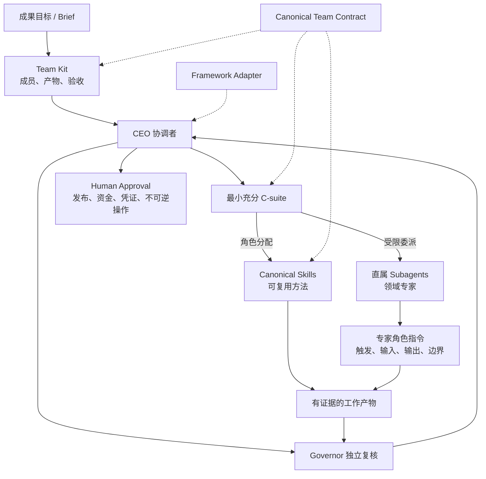
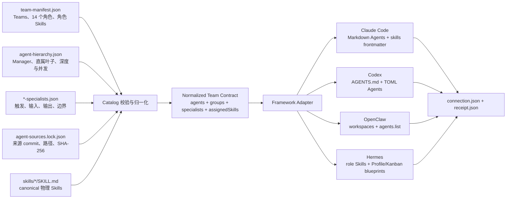
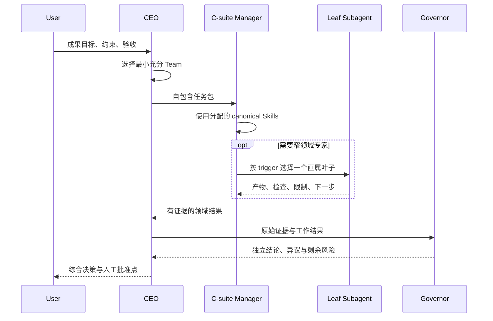

# Team、C-suite、Subagent 与 Skill 的连接原理

AGI Super Team 使用一份 canonical 组织契约，经过 Adapter 编译到不同 Agent 框架。它不是靠目录嵌套或软链接猜测组织关系，也不是简单的 `Team → C-suite → Subagent → Skill` 单链。

更准确的模型是一张有向图：Team 选择 C-suite；C-suite 一条支路获得可复用 Skills，另一条支路获得允许调用的直属 Subagents；二者共同产出可审查结果，再由 Governor 独立复核。

需要让 Agent 直接执行本章契约时，调用 [`orchestrate-agi-super-team`](../../skills/orchestrate-agi-super-team/SKILL.md)。该 Skill 会先识别当前框架，再选择原生树、Lead 平铺、顺序交接或仅结构接线模式。

## 一张图理解完整关系



## 构建时：组织契约如何编译



安装器按以下顺序处理：

1. 从 [`config/team-manifest.json`](../../config/team-manifest.json) 读取 Team、14 个 canonical 角色和每个角色的 Skill 分配。
2. 从 [`config/agent-hierarchy.json`](../../config/agent-hierarchy.json) 读取 Manager、直属 Subagent、最大深度和并发上限。
3. 从 `config/<manager>-specialists.json` 读取每个专家的精准触发、反触发、输入、输出、验收和权限边界。
4. 使用 [`config/agent-sources.lock.json`](../../config/agent-sources.lock.json) 校验 vendored 专家原文的来源 commit、路径和 SHA-256。
5. 只接受 `skills/<id>/SKILL.md` 中真实存在的 canonical Skills，生成 `assignedSkills.byAgent`。
6. 把同一份归一化契约交给目标 Adapter，渲染框架原生产物与 `connection.json`。
7. `--connect` 生成绑定 package、source revision 和 connection digest 的 `receipt.json`；结构接线不等于运行时验证。

## 运行时：任务如何流动



统一运行约束：

- CEO 是唯一公司级协调者，不创建第二个 CEO。
- 默认选择最小充分 C-suite，不因 `full-team` 可用就广播所有角色。
- Manager 只能调用路由表列出的直属角色，一轮最多两个并发叶子。
- 叶子和 Governor 不得继续委派；主会话到叶子共 **3 层**（main → CEO → C-suite → leaf）。
  Claude Code 侧由 `CLAUDE_CODE_MAX_SUBAGENT_SPAWN_DEPTH=3` 强制，Codex 侧由 `[agents] max_depth = 3` 强制。
  各框架的强制能力差异与路由分级见[路由分级与强制层](routing-and-enforcement.md)。
- Governor 独立复核，不由工作 Agent 自评代替。
- 发布、部署、凭证、资金、法律承诺和不可逆操作由人类最终批准。

## 四个主力框架如何真正执行

| 框架 | 发现入口 | Subagent / Team 机制 | AGI 执行策略 |
|---|---|---|---|
| Claude Code | `CLAUDE.md`、`.claude/agents/`、`.claude/skills/` | 普通 Subagent 独立上下文且不能继续创建 Subagent；Agent Teams 为实验功能 | 默认由主会话/Lead 平铺调用 Manager 与 Leaf；用户批准并启用实验功能后才用 Agent Teams |
| Codex | `AGENTS.md`、`.codex/agents/*.toml`、`.agents/skills/` | 父 Agent 管理子 Agent 树；真实深度受当前配置与版本限制 | 深度足够时使用两层树，否则由 CEO 平铺或顺序交接，并记录降级 |
| OpenClaw | `agents.list`、workspace/managed Skills、Agent skill allowlist | `sessions_spawn` 与 `allowAgents` 控制跨 Agent 会话 | 只使用 `connection.json` 中的精确 ID；Governor 从原始子会话证据独立复核 |
| Hermes | Profile 的 SOUL/Skills/config、`$HERMES_HOME/skills/` | `delegate_task` 是隔离短任务；Kanban 是跨 Profile/人工的持久队列 | 命名 C-suite 用 Profile + Kanban，一次性叶子用 delegation；蓝图存在不等于 Profile 已运行 |

框架机制、官方链接与证据等级见 Skill 的[框架参考](../../skills/orchestrate-agi-super-team/references/framework-mechanisms.md)。

## 五类连接分别由什么定义

| 连接 | 唯一事实来源 | 运行含义 |
|---|---|---|
| Outcome → Team | `team-manifest.json` 的 `kits[]` | 选择成果、核心成员、可选成员、产物与检查 |
| Team → C-suite | `coordinator`、`reviewers`、`coreAgents`、`agents` | CEO 协调，Governor 审查，其余角色按证据缺口启用 |
| C-suite → Subagent | `agent-hierarchy.json` + `*-specialists.json` | Manager 只能调用自己允许的直属叶子 |
| C-suite → Skill | `agents[].skills` → `assignedSkills.byAgent` | 给顶层角色分配经过物理存在检查的方法包 |
| Canonical Contract → Runtime | `cli-adapters.json` + `bin/adapters/*` | 翻译为目标框架支持的 Agent、Skill、权限和接线格式 |

## 为什么 Subagent 不自动继承 Manager 的全部 Skills

92 个专家 Subagent 是窄职责叶子，它们主要获得完整专家角色指令，而不是父 Manager 的全部 Skills。这样做有三个原因：

1. **减少上下文污染**：叶子只看到完成当前任务所需的职责与边界。
2. **避免权限扩散**：Manager 可用的方法和工具不自动下放给叶子。
3. **保持触发精度**：专家由 `trigger` 与 `doNotUseWhen` 选择，不因大量 Skill 描述产生语义竞争。

各框架的表达不同：

| 框架 | C-suite 与 Skills | Subagent 表达 |
|---|---|---|
| Claude Code | canonical Agent 的 `skills:` frontmatter 硬绑定 | 独立 Markdown Agent；默认不继承 Manager Skills |
| Codex | 映射写入 `connection.json`；Skill 全局可发现或显式触发 | 独立 TOML Agent，受 Manager 路由约束 |
| OpenClaw | C-suite 的 `agents.list[].skills` 明确绑定 | 独立 workspace；当前 `skills: []`，且禁止继续 spawn |
| Hermes | Profile 蓝图通过 `kanbanTaskSkills` 固定角色 Skill 与 canonical Skills | 专家本身渲染为 progressive role Skill |

如果未来某个专家确实需要固定 Skill，应在 canonical contract 中新增显式、可验证的 specialist Skill assignment；不要让它隐式继承整个 Manager Skill 集。

## 软链接与语义连接不是一回事

组织关系由 Manifest、运行时 ID、路由表和 `connection.json` 定义。软链接只用于复用一个内容完全一致的现有 Skill 目录：安装器会比较完整文件树，只有字节一致时才保留链接；不一致链接会拒绝安装。软链接不定义 Team、上下级或委派权限。

## 示例：Content Creator → CCO → 小红书运营专家

```text
content-creator Team
└── CEO：界定成果、选择 CRO / CCO / CMO
    ├── CCO：使用自己的内容与编辑 Skills
    │   └── ast-cco-xiaohongshu-operator：
    │       仅在需要达人分层、种草矩阵、投放排期或转化复盘时调用
    ├── CMO：负责定位、增长与测量
    ├── CRO：负责来源和证据
    └── Governor：独立检查声明、证据与人工发布门
```

这里“小红书运营专家”不会自动获得 CCO 的全部 Skills；CCO 负责选择方法和拆解任务，叶子只完成边界清楚的专家交付。

## English summary

AGI Super Team is a directed contract graph, not a directory inheritance chain. An outcome Team selects the CEO, a minimal C-suite roster, and the Governor. Each C-suite role receives its own canonical Skills and, when it is a Manager, an explicit allowlist of direct specialist Subagents. Specialists carry bounded role instructions and do not inherit every Manager Skill. Framework Adapters compile the same normalized contract into native Claude Code, Codex, OpenClaw, or Hermes artifacts, then write a connection specification and an evidence-bounded receipt.
